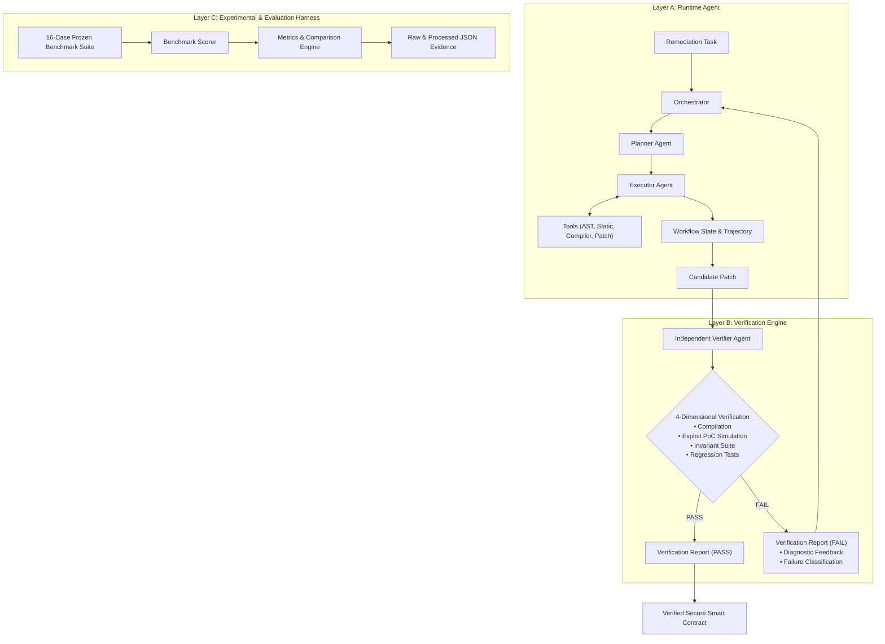

# Litmus Architecture Specification

This document provides a detailed technical breakdown of the 3-layer architecture, component responsibilities, state transitions, tool interfaces, and verification loops.

---

## 1. High-Level Architecture Overview

Litmus is structured strictly around **three isolated layers**:



---

## 2. Component Responsibility Matrix

| Component | Layer | Input | Output | Why It Exists | Failure Mode Handled | Evaluation Method |
| :--- | :--- | :--- | :--- | :--- | :--- | :--- |
| **`OrchestratorAgent`** | Layer A | `RemediationTask` | `WorkflowState` | Manages state machine, execution transitions, retry budgets, and trajectory logging | Uncontrolled infinite retry loops or unhandled workflow exceptions | Unit tests (`test_agents.py`) & full trajectory verification |
| **`PlannerAgent`** | Layer A | `RemediationTask` + Diagnostics | `Plan` (with `PlanStep`s) | Decomposes complex multi-hop exploits into structured steps and maps required invariants | Hallucinated naive one-line fixes that break downstream functions | Structured JSON schema validation and replanning accuracy |
| **`ExecutorAgent`** | Layer A | `PlanStep` + `WorkflowState` | `ToolInvocation` & Draft Patch | Interacts with analysis tools and synthesizes candidate code | Syntax errors, unclosed braces, or missing modifier declarations | Tool execution time and AST mutation fidelity |
| **`VerifierAgent`** | Layer B | Candidate Patch Code | `VerificationReport` | Independently validates candidate patches against 4 core dimensions | False-positive claims where LLM claims a fix without testing exploit or invariants | Scorer validation test suite (`test_evaluator.py`) |
| **`ASTParserTool`** | Layer A | Solidity Code | Structured AST Dict | Extracts function scopes, state variables, visibility, and CEI call ordering | Parsing errors and misidentified function boundaries | `test_tools.py::test_ast_parser_tool` |
| **`StaticAnalyzerTool`** | Layer A | Solidity Code | Vulnerability Findings | Detects known anti-patterns (reentrancy, missing access control, oracle staleness, fee mismatch) | Silent code vulnerabilities | `test_tools.py::test_static_analyzer_tool` |
| **`ContractCompilerTool`** | Layer A/B | Solidity Code | Compilation Status | Validates syntax, balanced braces, typing, and solc AST compatibility | Syntax errors and invalid types | `test_tools.py::test_contract_compiler_tool` |
| **`ExploitRunnerTool`** | Layer B | Code + Exploit PoC | Attack Outcome | Simulates the exploit attack vector to verify if exploit succeeds or reverts | Flawed patches that still permit exploit execution | `test_tools.py::test_exploit_runner_tool` |
| **`InvariantCheckerTool`** | Layer B | Code + Invariants | Invariant Status | Evaluates formal protocol invariants (solvency, legitimate withdrawal flows) | Patches that neutralize exploit by breaking legitimate users | `test_tools.py::test_invariant_checker_tool` |
| **`PatchTool`** | Layer A | Original + Patch Code | Patched Solidity Source | Applies surgical diffs and function replacements | Corrupted file updates and formatting breaks | `test_tools.py::test_patch_tool` |
| **`BenchmarkScorer`** | Layer C | `BenchmarkCase` + Patch | `CaseEvaluationResult` | Provides objective, reproducible evaluation scoring | Biased or subjective evaluation metrics | `test_evaluator.py` self-validation suite |

---

## 3. Workflow State Architecture

Workflow state is tracked via explicit Pydantic models in `workflow/state.py`:

```python
class WorkflowState(BaseModel):
    task: RemediationTask
    user_context: Dict[str, Any]
    current_stage: Literal["RECEIVED", "PLANNING", "EXECUTING", "VERIFYING", "REPLANNING", "SUCCESS", "FAILED"]
    plan: Optional[Plan]
    current_step_index: int
    observations: List[str]
    tool_results: List[ToolInvocation]
    intermediate_outputs: Dict[str, Any]
    current_patch_code: Optional[str]
    verification_history: List[VerificationReport]
    failures: List[Dict[str, Any]]
    retry_count: int
    max_retries: int
    final_result: Optional[str]
    is_success: bool
    trajectory: List[ExecutionTrajectoryEntry]
    started_at: float
    finished_at: Optional[float]
```

Every transition appends a typed `ExecutionTrajectoryEntry` containing stage, agent name, action summary, inputs, outputs, and timestamp.

---

## 4. Verification & Feedback Loop

When `VerifierAgent` rejects a candidate patch:
1. **Failure Classification:** The verifier classifies the failure (`syntax_error`, `exploit_not_neutralized`, `invariant_violated`, `regression_introduced`, `interface_broken`).
2. **Actionable Feedback:** The verifier generates diagnostic logs detailing the exact failure point (e.g. *"Withdraw function call succeeded but credited balance delta was zero"*).
3. **Retry Budget:** If `retry_count < max_retries` (default 3), `Orchestrator` increments `retry_count` and passes the diagnostic report to `PlannerAgent.replan()`.
4. **Targeted Replanning:** The planner creates a revised plan addressing the specific invariant failure without re-introducing prior bugs.
5. **Re-Execution & Re-Verification:** The executor synthesizes the corrected patch and submits it to Layer B for re-verification.

If the retry budget is exhausted, the orchestrator terminates the workflow with state `FAILED` and outputs a diagnostic limitation report, ensuring the system never enters infinite loops or emits unverified code.
