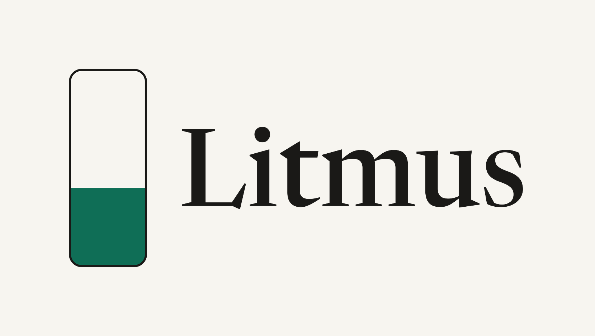
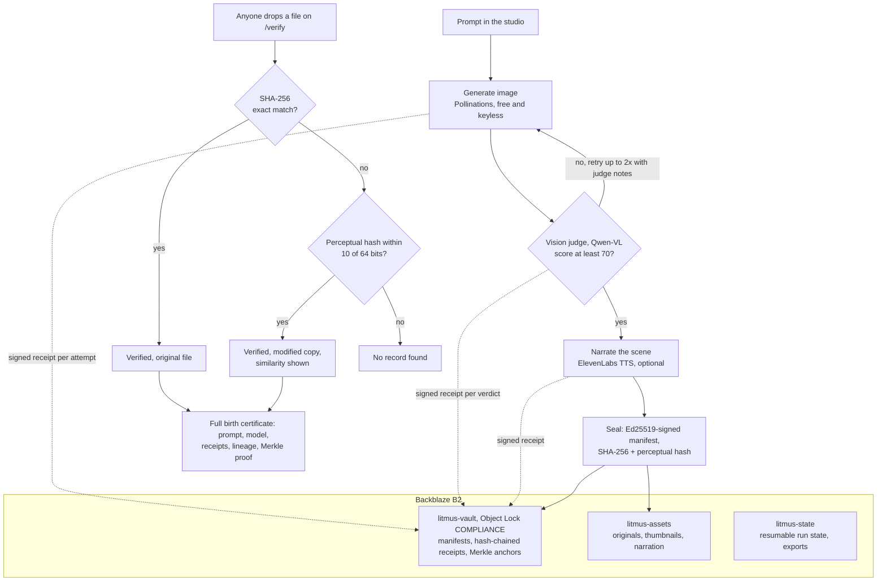

# Litmus

A generation studio where every AI asset is born with a signed birth certificate, sealed in write-once storage, and verifiable even from a cropped screenshot.

Built for the Backblaze Generative Media Hackathon on Backblaze B2 Object Lock and the Genblaze pipeline SDK.

## What is it?

Litmus adds five parts to a generation workflow:

- **Studio** takes a prompt, generates an image, and optionally narrates it. Every pipeline step streams into a ledger timeline as it happens.
- **Judge** is a vision model that scores each generation against the brief, 0 to 100. Under 70 the pipeline retries, up to twice, feeding the judge's notes back into the prompt. Rejected attempts are kept, receipted, and visible as discarded candidates.
- **Vault** stores every record in Backblaze B2. Manifests, per-step receipts, and Merkle anchors go into a bucket with Object Lock in compliance mode. Once written, nobody can alter or delete them until retention expires. Not the operator. Not Backblaze.
- **Verify** is a public page. Anyone drops in a file, no account. Exact SHA-256 match proves the original bit for bit. A perceptual hash recovers the record from cropped, re-compressed, or screenshotted copies.
- **Export** produces a signed zip of the whole vault plus an offline `verify.py` that checks everything without this service existing.

The server signs every manifest and receipt with Ed25519. The browser re-verifies signatures and Merkle inclusion proofs itself, so you do not have to trust the server.

## How it works



Receipts are hash-chained per run and sealed with a compliance lock the moment each step completes, including failures. Run state persists to B2 after every transition, so a killed server resumes its runs on restart, and the SQLite fingerprint index rebuilds itself from the vault. Hourly Merkle anchors bind all new manifests into one locked root object.

## Why use it?

- Provenance that survives the screenshot. Metadata dies at the first re-encode; the perceptual fingerprint does not.
- An audit trail of decisions, including the attempts the judge threw away and why.
- Tamper-proofing that is a storage property, verified live: deleting a locked receipt version returns `AccessDenied`.
- Your history is portable. The export verifies offline, forever.

Verification quality depends on the fingerprint: heavy crops, mirrors, and rotations can defeat the perceptual hash, and the bit-for-bit claim is only ever made on an exact hash plus signature match.

## Install

```bash
git clone https://github.com/fozagtx/litmus && cd litmus
python3.11 -m venv .venv && source .venv/bin/activate
pip install -r server/requirements.txt
cp .env.example .env        # fill in keys, see Configuration
python scripts/gen_keys.py  # Ed25519 signing keypair
```

Requires Python 3.11+ and Node 20+ for the frontend.

## Quick start

Full setup from a fresh B2 account, using the master key once to bootstrap:

```bash
# .env: set B2_MASTER_KEY_ID + B2_MASTER_APP_KEY, DASHSCOPE_API_KEY, ELEVENLABS_API_KEY
python scripts/bootstrap_b2.py     # creates the 3 buckets (vault locked), mints a scoped runtime key
python scripts/check_providers.py  # validates your model slugs against live catalogs
uvicorn server.main:app --port 8000
cd web && npm install && npm run dev   # UI on :5173, proxies /api to :8000
```

Already have buckets and a scoped application key:

```bash
# .env: set B2_REGION, B2_KEY_ID, B2_APP_KEY, bucket names, provider keys
python scripts/create_buckets.py   # idempotent, verifies the vault lock
uvicorn server.main:app --port 8000
```

Docker, serving the built frontend from the same process:

```bash
docker build -t litmus .
docker run --env-file .env -p 8000:8000 litmus
```

## Configuration

All configuration is environment variables, loaded from `.env`. Missing values surface as honest 503s naming the variable, never as fake output.

- `DASHSCOPE_API_KEY` (Alibaba Model Studio) powers the vision judge (`qwen-vl-plus`) and narration text (`qwen3.6-flash`); `ELEVENLABS_API_KEY` powers the voice.
- `IMAGE_PROVIDER` selects image generation: `pollinations` (default, keyless and free) or `alibaba` (DashScope `wan2.7-image`). When a DashScope key is present, Pollinations outages automatically fail over to Alibaba for new runs.
- `IMAGE_MODEL`, `JUDGE_MODEL`, `NARRATION_TEXT_MODEL`, `TTS_MODEL` override the per-provider defaults; leave blank to use them.
- `B2_REGION`, `B2_KEY_ID`, `B2_APP_KEY`, `B2_ASSETS_BUCKET`, `B2_VAULT_BUCKET`, `B2_STATE_BUCKET` point at your buckets.
- `VAULT_RETENTION_DAYS` sets the compliance retention (7 for the demo; raise for production; irreversible per object once written).
- `JUDGE_THRESHOLD`, `MAX_ATTEMPTS`, `PHASH_MAX_DISTANCE` tune the loop and matcher.

## Useful commands

```text
python scripts/gen_keys.py          generate the Ed25519 signing keypair
python scripts/bootstrap_b2.py      one-shot account setup from the master key
python scripts/create_buckets.py    create/verify buckets with a scoped key
python scripts/check_providers.py   validate model slugs against live catalogs
python scripts/reindex.py           rebuild the fingerprint index from the vault
python scripts/smoke_local.py       offline test suite, no network
```

## Important limits

- Compliance lock is irreversible. Every object is schema-validated and signed before a locked write, because a mistake cannot be deleted for the retention period.
- "No record found" never means a file is fake. It means this vault did not seal it. The UI copy enforces this.
- The trust root is the service signing key: v1 proves this service sealed a record at a time, which is tamper-evident notarization, not identity attestation of the human. Per-user keys are schema'd for the roadmap.
- Merkle roots are computed by the operator. Locked receipts make retroactive edits impossible; publishing roots externally is the roadmap fix for pre-seal trust.
- The public verify endpoint caps uploads at 25 MB, rate-limits by IP, and never stores uploaded files.
- Prompts are public by design: anyone who verifies an asset can read its prompt, and the studio says so before you generate.
- Audio verification is exact-hash only in v1.

## Development

```bash
python scripts/smoke_local.py            # signing, fingerprint, Merkle, index, chains
python -m compileall server scripts      # syntax gate
cd web && npx tsc --noEmit && npm run build
```

The Dockerfile builds the frontend and serves it from the FastAPI process on one port, so it deploys to any container host. `SIGNING_KEY_B64` carries the signing key on hosts with ephemeral disks.
